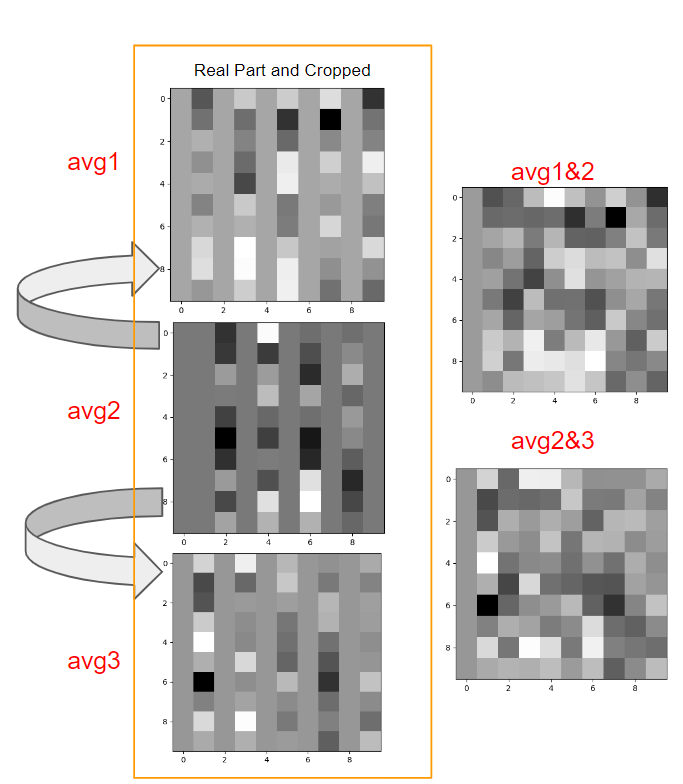
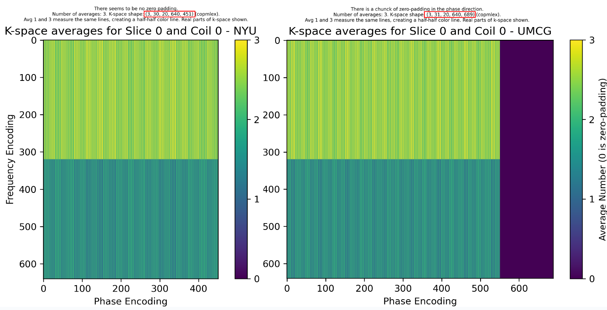

# T2w Transversal/axial k-space Data Conversion for AI
This pipeline is designed for converting T2w Transversal/axial k-space data from Siemens MRI scanners into a format suitable for deep learning applications. The process involves three key stages: 

1. **Conversion Workflow**: 
   - Convert raw .dat files to .mrd format using the ISMRMRD framework.
   - Further convert .mrd files to .h5 format, maintaining all essential metadata and headers.
   
2. **Handling Interleaved Averages**:
   - The k-space data contains three interleaved averages. Unlike traditional methods that average these, this pipeline preserves all three averages for enhanced flexibility in reconstruction.

3. **Metadata Integrity**:
   - Headers and DICOM metadata are preserved to ensure accurate reconstruction, with an option to restore original Field of View (FOV) if needed yet to be released.

The output .h5 files are optimized for training and inference in AI models, with careful handling of k-space data to maintain high fidelity in the final reconstructed images.


# General Pipeline Processing Steps
1. **Check Database**: Determine which steps are required for the current patient.
2. **Convert .dat to .mrd**:
   - Utilize the [siemens_to_ismrmrd](https://github.com/ismrmrd/siemens_to_ismrmrd) tool.
3. **Anonymize DICOM**:
   - Store DICOM files and headers to restore the 'correct' FOV after reconstruction.
   - FOV used for lesion segmentation if available.
4. **Copy Niftis**: If required.
5. **Link DICOM and k-space**: Based on study date.
6. **Convert .mrd to .h5**:
   1. **Convert to Array**:
      - Build k-space array from ISMRMRD object.
      - Reorder k-space array and fix interleaving.
      - Remove zero-padding, crop, normalize, and apply Root Sum of Squares (RSS) if required.
   2. **Extract Metadata**: T2w Tra metadata is stored in the H5.
7. **Transfer Data**: Send to a high-performance cluster for deep learning reconstruction model training or inference.

# Configuration
*To Be Determined (TBD)*

# K-space Averages
The first and third averages measure odd lines, while the second average measures even lines. You can create one k-space from all three averages:
K<sub>full</sub> = (K<sub>1</sub>+K<sub>3</sub>)/2 + K<sub>2</sub>


# Database
A database table in SQLite tracks the status of each processing step from .dat to .mrd to .h5. Configurations are stored in a configuration file.

# Examples
Example slice of k-space averages and their ordering for NYU and UMCG data.



# Converting DWI
siemens_to_ismrmrd -f data/0003/kspaces/meas_MID00396_FID373318_ep2d_diff_b50_500_1000_tra_p2.dat \
-m custom_param_maps/dwi/IsmrmrdParameterMap_Siemens_DIAG.xml \
-x custom_param_maps/dwi/IsmrmrdParameterMap_Siemens_EPI_DIAG.xsl \
-o data/0003/kspaces/meas_MID00396_FID373318_ep2d_diff_b50_500_1000_tra_p2.mrd \
-Z


# Echo Train Mapping
In this repository there is also an option to make an SQLite database with echo train information.
If you want to drop specific echo trains from the data then making a map which echo train measures which column indexes can be created.
For example: We perform uncertainty quantification of deep learning reconstruction by leaving out some echo trains when reconstructing.
Example echo train mapping:
```rows, cols = 640, 551
ksp_shape = (640, 551)
mapping = {
'0': [429, 411, 393, 375, 357, 339, 321, 303, 285, 267, 249, 231, 213, 195, 177, 159, 141, 123, 105, 87, 69, 51, 33, 15, 547],
'1': [431, 413, 395, 377, 359, 341, 323, 305, 287, 269, 251, 233, 215, 197, 179, 161, 143, 125, 107, 89, 71, 53, 35, 17, 549],
'2': [441, 415, 397, 383, 367, 343, 329, 315, 299, 275, 255, 235, 219, 207, 185, 171, 155, 133, 115, 95, 73, 59, 37, 19, 1],
'3': [435, 417, 401, 387, 361, 347, 325, 307, 293, 273, 257, 243, 223, 209, 189, 163, 147, 127, 113, 93, 81, 55, 47, 23, 9],
'4': [437, 423, 407, 381, 371, 351, 333, 313, 291, 281, 261, 237, 227, 205, 183, 173, 145, 131, 111, 99, 75, 57, 39, 21, 3],
'5': [443, 419, 399, 379, 365, 345, 335, 311, 295, 271, 263, 245, 221, 203, 187, 169, 151, 129, 117, 91, 83, 63, 41, 29, 7],
'6': [433, 425, 405, 385, 369, 349, 331, 317, 289, 279, 253, 241, 217, 201, 191, 165, 153, 137, 119, 101, 77, 61, 43, 27, 11],
'7': [439, 421, 403, 389, 363, 353, 327, 309, 297, 277, 259, 239, 225, 199, 181, 167, 149, 135, 109, 97, 79, 65, 45, 25, 5],
'8': [445, 427, 409, 391, 373, 355, 337, 319, 301, 283, 265, 247, 229, 211, 193, 175, 157, 139, 121, 103, 85, 67, 49, 31, 13],
'9': [447, 451, 455, 459, 463, 467, 471, 475, 479, 483, 487, 491, 495, 499, 503, 507, 511, 515, 519, 523, 527, 531, 535, 539, 543],
'10': [449, 453, 457, 461, 465, 469, 473, 477, 481, 485, 489, 493, 497, 501, 505, 509, 513, 517, 521, 525, 529, 533, 537, 541, 545]
}```
